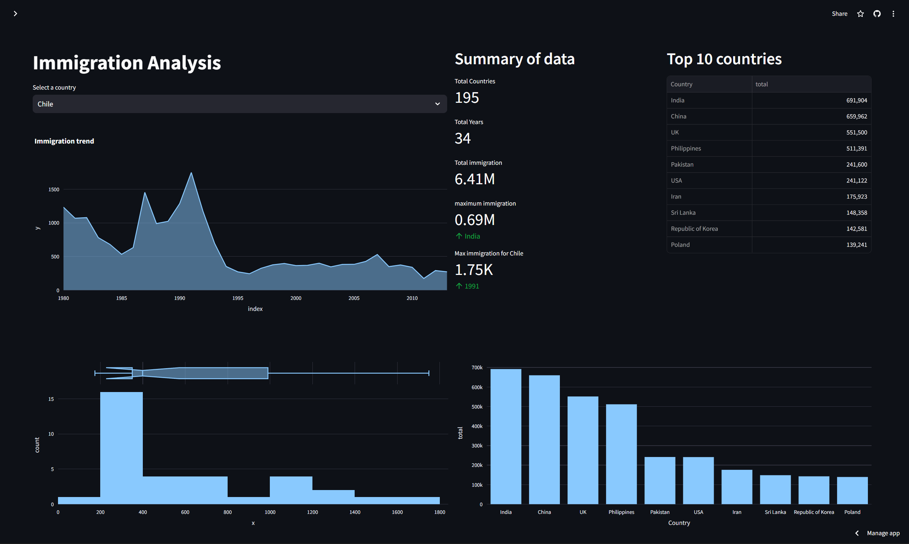

# Immigration Data Analysis



# live version
[Streamlit](https://zaid-kamil-immigration-analysis-2024-dashboard-quat04.streamlit.app/)
## Project Summary
The goal of this project is to analyze the United Nations dataset on international migration. The dataset contains information on the number of immigrants leaving coutries per year (1980-2013).

## Tech Stack
- Python
- Pandas
- Plotly
- Streamlit

## Installation

1. Clone the repository
```bash
git clone <repo-url>
```

2. Install the dependencies
```bash
pip install - requirements.txt
```

3. Run the Streamlit app
```bash
streamlit run dashboard.py
```
